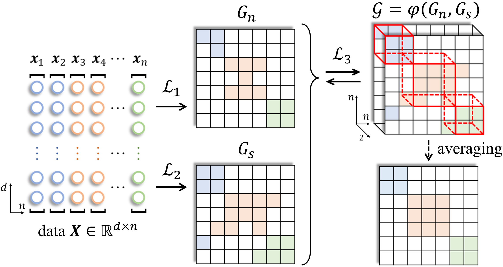

# TGL

Source codes of "From one comes two: a tensorized graph learning framework for clustering" accepted by IEEE TKDE

If you find the codes useful in your research, please cite our work as follows. Thanks.

@article\{TGL, 
      &nbsp;&nbsp;&nbsp;&nbsp;title=\{From one comes two: a tensorized graph learning framework for clustering\}, 
      &nbsp;&nbsp;&nbsp;&nbsp;author=\{Zheng, Qinghai and Zhu, Jihua, and Yu, Yuanlong and Tang, Haoyu\}, 
      &nbsp;&nbsp;&nbsp;&nbsp;journal=\{IEEE Transactions on Knowledge and Data Engineering\}, 
      &nbsp;&nbsp;&nbsp;&nbsp;year=\{2025\}, 
      &nbsp;&nbsp;&nbsp;&nbsp;doi=\{10.1109/TKDE.2025.3622333\} 
\} 

Email: zhengqinghai@fzu.edu.cn; qhxjtu@163.com

